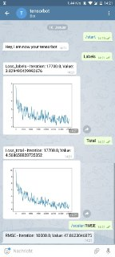

# tensorbot
Tensorboard as a Telegram Chatbot.

## Getting started

### Installation
The Bot should work with Python 2 & 3, but I'll assume you have pip installed.

- Install requirements: `pip install -r requirements.txt`

Running tensorboard requires the packages `tensorboard` and `tensorflow` which
are not in the requirements for this package.

### Getting a token
- You obviously need a Telegram account
- Read https://core.telegram.org/bots
- Chat with [`@botfather`](https://telegram.me/botfather) to create a new bot and get a associated token
- Save token as file with name `token` in the root directory

### Running tensorbot and tensorboard
- Start tensorboard, the default Tensorbot configuration assumes you are
  running it inside the dir containing the log file: `tensorboard --logdir .`
- Run `python bot.py`. Optional  arguments are
    - `--url`: Tensorboard url, default `http://localhost:6006`
    - `--token`: Your telegram bot token, default is reading the token from a file called token
    - `--run`: Select the run you want to use Tensorbot with, defaults to `.`

### Communicating with tensorbot
- `/start` to initiate chat and select run
- `/run` to select run
- `/plot <scalar name>` to pull most recent plot
- `/value <scalar name>` to get most recent iteration and value

